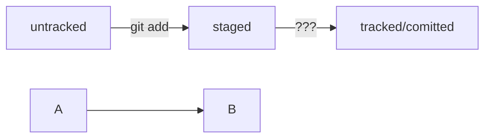

# Загоовок 1

Проверка чтото там
---
*Ещё* _что_ **то** __там__ ~~непонятно~~

## Списки
1. один
2. Ещё один

* Раз
* Ещё раз

- Кусок
- Ещё кусок

```
mkdir my_project
cd my_project
git init
```

HEAD -- это голова.
Коммит -- это всему голова.
Статусы файлов:
<тут пустая строка!>

```mermaid
%% описание схемы
```
<и тут пустая строка!> 

